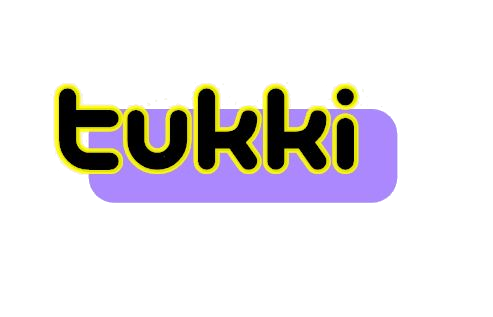

<p align="center">
  <a href="" target="blank"></a>
</p>

<p align="center" ><b>Tukki Music App</b>, la aplicación de música de la comunidad.</p>

<p align="center">
    <a href="https://www.npmjs.com/~nestjscore" target="_blank"></a>
    <a href="https://www.npmjs.com/~nestjscore" target="_blank"></a>
</p>

# Tukki-Music-App

Esta aplicación con la que podrás escuchar canciones y tener tus propias playlists a la vez que buscar canciones y usuarios.

## Instalación

#### Frontend -- React
```javascript

cd frontend
npm install
npm run start
+ configurar proxy en el package.json

```

#### API y Backoffice

```javascript


```


## Tecnologías

Para elaborar este proyecto se ha recurrido a la utilización de dos tecnologías actuales muy importantes como son `NestJS` y `ReactJS` o `React`.
Sus repositorios principales:

-  [React](https://github.com/facebook/react): **Librería** de JavaScript para el diseño de interfaces.


## Images

Algunas imágenes de la aplicación:

 -  Login Light


 -  Login Dark


 -  App Funcionando


## Author

 -  David Fernandez Flores
